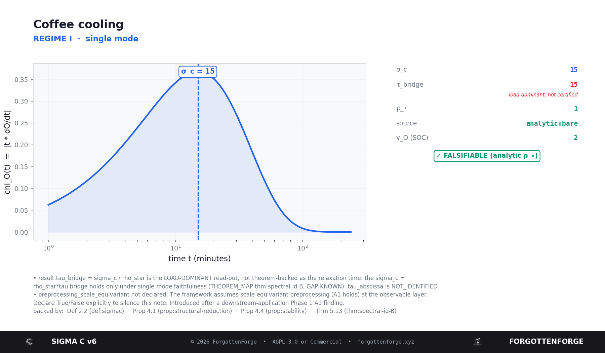
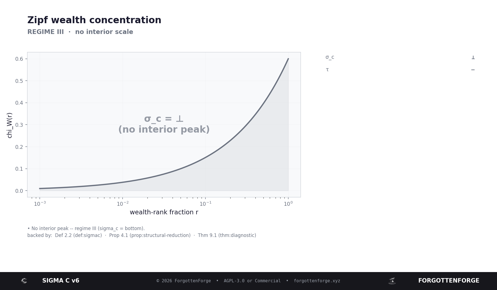
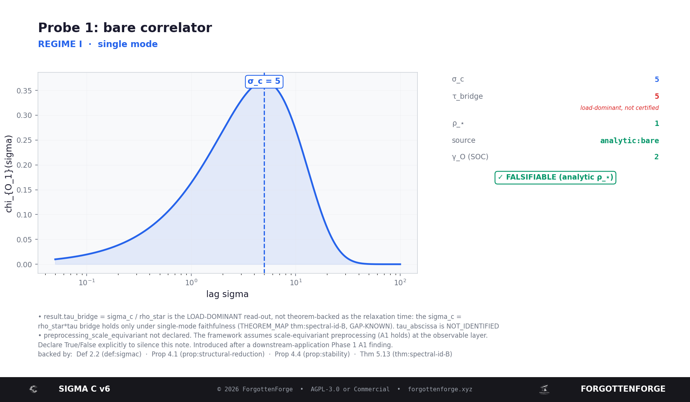
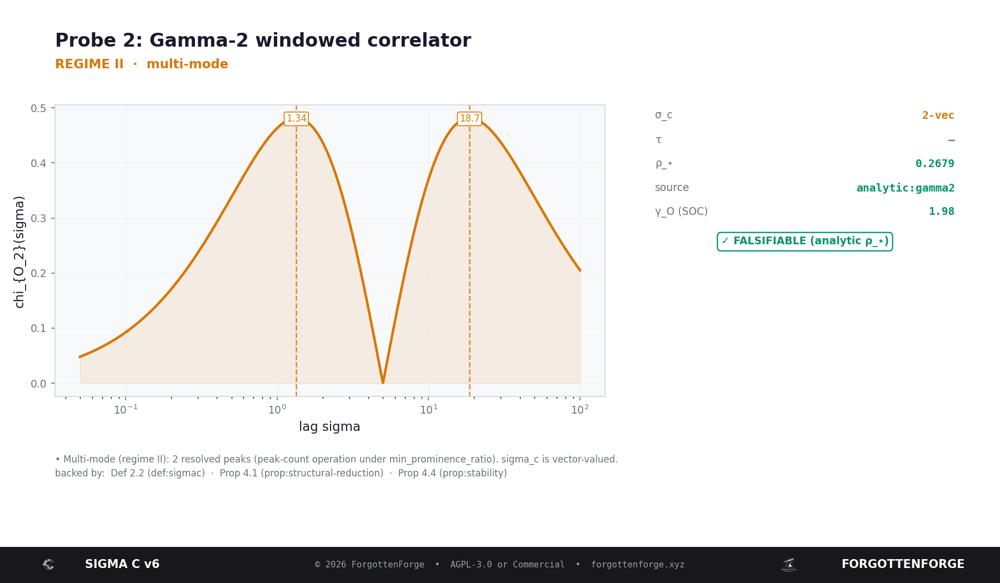
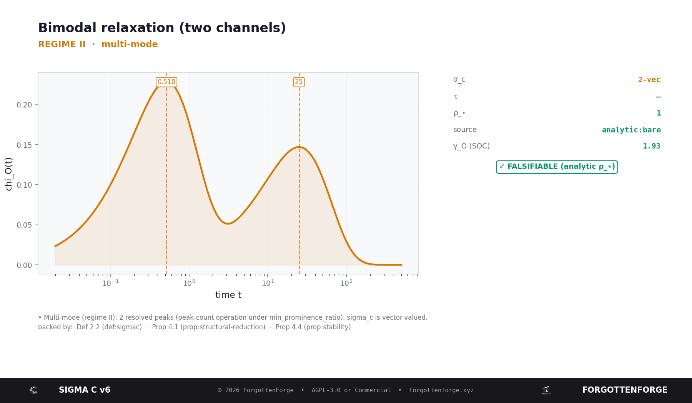
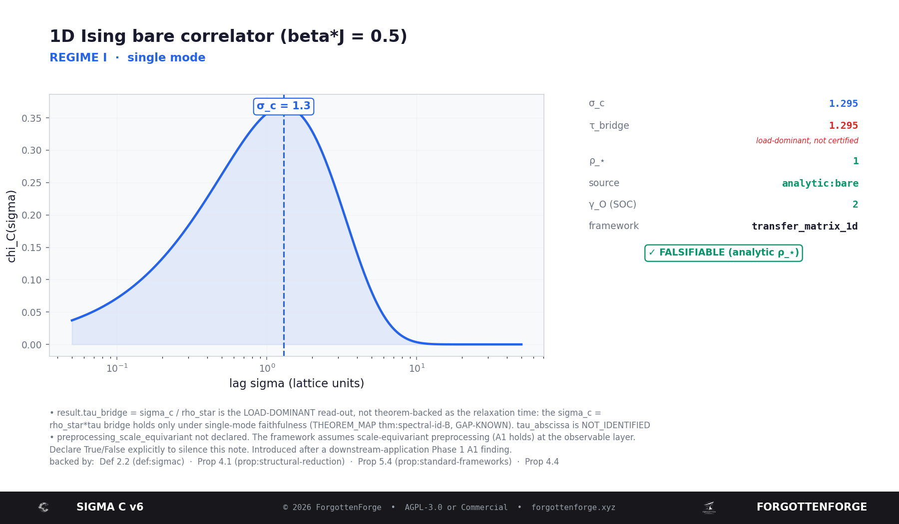
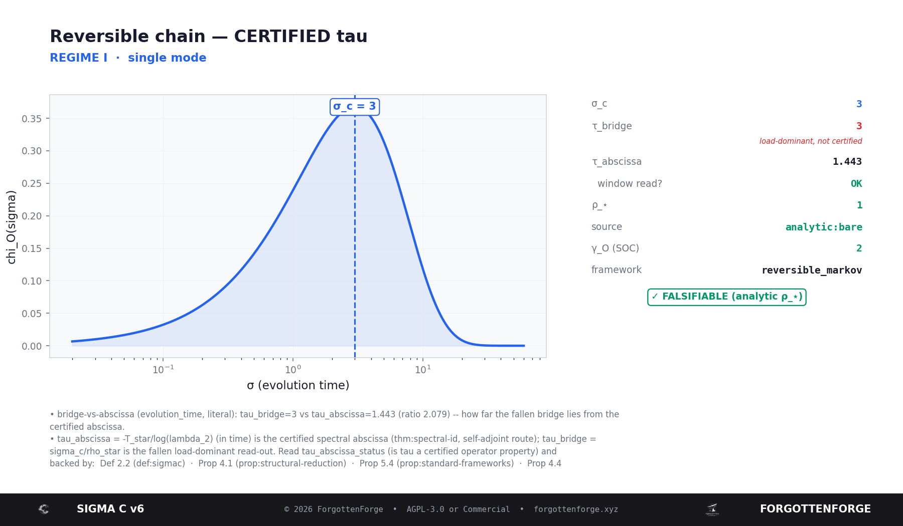

# The example cards, explained in plain words

Each example is a tiny `.py` you can run. It builds a curve, hands it to the
tool, and saves a **card** (a PNG) next to the script. This page explains, for
every card: what we did, what the card shows, what each number means, and what you
are allowed to conclude from it.

If you are new here, read "How to read any card" once, then jump to the example
you ran.

---

## How to read any card

> **Unfamiliar words?** `ρ⋆`, `τ`, `self-adjoint`, `argmax`, `L²(π)`, `SOC` are glossed
> in the main [README](../../README.md) under "Plain words for the jargon". The first
> few cards use almost none of them; the advanced card (#6, τ) uses more.

Every card has the same parts:

- **Title + regime line.** The regime is the tool's first, coarsest answer:
  - **REGIME I — single mode:** the curve has one clear bump. There is one scale.
  - **REGIME II — multi-mode:** several bumps. `σ_c` becomes a *list*, not one number.
  - **REGIME III — no interior scale:** no bump at all. `σ_c = ⊥` (bottom) — and that
    "there is nothing here" is the honest answer, not a failure.
- **The curve (left).** This is `χ_O(σ) = |σ · dO/dσ|`, the *sensitivity*: how
  strongly your measurement `O` reacts when you change the scale `σ`. Where it peaks
  is where "something happens". The dashed line marks `σ_c`. (Each example labels its
  own axes — e.g. `chi_W(r)` in the wealth example, where the measurement is wealth
  `W` and the dial is rank `r` — but it is always this same sensitivity idea.)
- **The numbers (right).** Read the **colour**: green = trustworthy, red = a number
  you must not over-trust, grey = not available.
- **The badge.** `✓ FALSIFIABLE` (green) means the window's constant is *analytic*
  (exact), so the reading can be checked and refuted. `⚠ FITTED` (red) means a
  constant was fitted from the data, so treat it as exploratory.
- **The notes + "backed by".** The honest small print, and the paper labels each
  output leans on (with their proof status, e.g. `[GAP-KNOWN]`).

The recurring numbers:

| field | what it means | trust |
|---|---|---|
| `σ_c` | the scale where your curve is most sensitive | the main reading |
| `τ_bridge` | `σ_c / ρ_⋆` — the **load-dominant** read-out | **red: a diagnostic, NOT a certified time** |
| `τ_abscissa` + `window read?` | the **certified** relaxation time `−T*/log λ₂` | only appears on the reversible / self-adjoint route |
| `ρ_⋆` + `source` | the window's convention constant | green if `analytic:*`, red if `fitted` |
| `γ_O (SOC)` | a stability indicator of the peak | green if healthy |
| `framework` | which model the tool was told to assume | — |

The one thing to remember: **`τ_bridge` (red) is not the relaxation time.** It reads
the *most-susceptible* mode, which is the slowest one only under a special condition.
The *certified* time is `τ_abscissa`, and it only shows up when you give the tool a
reversible operator (see example 6).

---

## 1 · Coffee cooling — `01_coffee_cooling.py`

**What we did.** We took Newton's law of cooling: a hot drink's temperature
difference from the room fades away like `exp(-t / τ_cool)`. We handed that fading
curve to the tool and asked "where does cooling stop being fast and turn slow?"

**What the card shows.** Regime I, one clean bump. `σ_c` sits exactly at the cooling
time `τ_cool`.

**What the numbers mean.** `σ_c` = the characteristic cooling time. `ρ_⋆ = 1` with
`source = analytic:bare` (green), so the reading is exact and the badge is
`✓ FALSIFIABLE`. `τ_bridge` equals `σ_c` here (because `ρ_⋆ = 1`) but is still shown
in red — a reminder that it is a diagnostic, not a certified relaxation time.

**What you can take from it.** The tool recovered a number we already knew (the
cooling time) directly from the curve, and told us how trustworthy it is. This is
the "hello world": it shows the instrument measures what it should.

---

## 2 · Wealth distribution — `02_zipf_wealth.py`

**What we did.** We fed it a Zipf / Pareto wealth curve — the textbook
*scale-invariant* case, where wealth concentration looks the same at every scale.

**What the card shows.** Regime III. `σ_c = ⊥` (bottom) — the big centred symbol
means "no interior scale here".

**What the numbers mean.** There is no `σ_c` number, on purpose. The verdict is
`NOT_RESOLVABLE`: not "the tool failed", but "your data has no single scale to find".

**What you can take from it.** This is the most important lesson of the whole tool:
**most tools hand you a number even when none exists; this one says "no" as a typed,
checkable answer.** A refusal here is a *correct* result.

---

## 3 · Two windows on one system — `03_two_windows.py` (cards 3a, 3b)

**What we did.** We took ONE system (an exponential correlator with a true time
`τ`) and looked at it through two different "lenses" (windows): a plain one (`bare`)
and a shaped one (`gamma2`). Card 3a is the plain lens, card 3b is the shaped one.

**What the cards show.** The two lenses report *different* `σ_c` values. Card 3b
(gamma2) even shows **regime II — two bumps**. That looks like a contradiction, but
it is not.

**What the numbers mean.** The window carries a known constant `ρ_⋆`. The rule
`σ_c / ρ_⋆ = τ` means the different `σ_c` values are just the same truth seen through
different conventions — divide out `ρ_⋆` and both lenses agree on `τ`. Because the
shaped lens splits into two lobes, `two_probe_test` **declines** rather than forcing
the two into one number.

**What you can take from it.** A probe-dependent `σ_c` is a *convention factor*, not
a measurement error. And when a single number would be dishonest (two lobes), the
tool refuses to invent one until you *declare* which lobe you mean.

---

## 4 · Bimodal relaxation — `04_bimodal_relaxation.py`

**What we did.** We built a signal that relaxes through **two** channels at once —
a fast one and a slow one.

**What the card shows.** Regime II (amber), with **two** dashed markers. `σ_c` is a
`2-vec` (a list of two scales), roughly `0.5` and `25`.

**What the numbers mean.** `σ_c = 2-vec` says "there are two scales here, and I will
not average them into one fake number". `τ` is shown as `—` because a single
relaxation time is not defined for a two-scale system.

**What you can take from it.** When there really are several scales, the honest
output is a *list*, not one number. Averaging would hide the physics; the tool
surfaces it instead.

---

## 5 · 1D Ising correlation length — `05_ising_chain.py`

**What we did.** We took the exact spin–spin correlator of the 1D Ising chain at
`βJ = 0.5`, whose correlation length is known in closed form,
`τ = −1/log tanh(βJ) ≈ 1.295`.

**What the card shows.** Regime I, one bump, `σ_c ≈ 1.295` — it lands on the
textbook correlation length.

**What the numbers mean.** `σ_c` = the correlation length. `ρ_⋆ = 1`,
`source = analytic:bare` (green), badge `✓ FALSIFIABLE`. `τ_bridge` equals `σ_c`
again (red, because it is still only the load-dominant read-out).

**What you can take from it.** On a system with a known exact answer, the tool
reproduces the textbook number. That is what makes the *refusals* elsewhere
credible: the same instrument that says "no" in example 2 says the right "yes" here.

---

## 6 · Certified τ on a reversible chain — `demo_reversible_tau.py`

**What we did.** We gave the tool a real **reversible** Markov chain (a transfer
operator that obeys detailed balance) and asked for the intrinsic relaxation time —
not the load-dominant diagnostic, the *certified* one.

**What the card shows.** This is the one card where **`τ_abscissa` appears in black
with `window read? = OK`** — a certified relaxation time. Next to it, `τ_bridge = 3`
sits in red, labelled "load-dominant, not certified". `framework = reversible_markov`.

**What the numbers mean.**
- `τ_bridge = 3` — the fallen bridge (`σ_c / ρ_⋆`): a diagnostic only.
- `τ_abscissa = 1.443` — the certified time `−T*/log λ₂`, because the tool *verified*
  the operator is self-adjoint in `L²(π)` (it derived the stationary distribution and
  checked detailed balance).
- `window read? OK` — with a faithful probe and a long enough window, the rate is
  actually readable, not just defined.

**What you can take from it.** This is the difference the whole edition is built
around: `τ_bridge` is a number that *looks* like a relaxation time but is only a
diagnostic; `τ_abscissa` is the one you may actually quote — and it only appears
after the tool has *verified* the precondition. The companion drift-walk in the same
script is refused (`NOT_APPLICABLE`): it is euclidean-normal but not reversible, and
the tool declines the case it cannot certify instead of returning a number that
looks fine.

---

*A number is only as good as the verdict next to it. Read the verdict first.*
